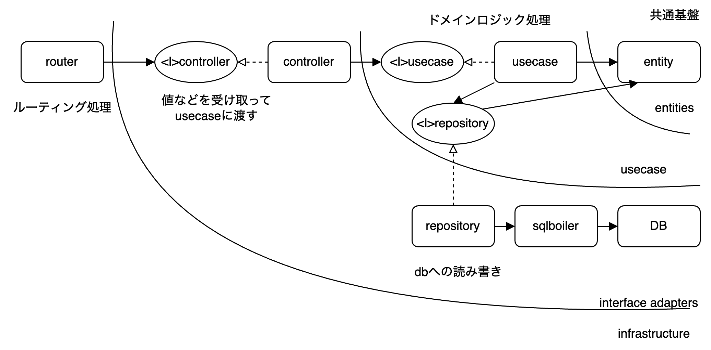

# MAGISCHE

### 初回実行

以下のコマンドにより，env作成・build・up・migrateまで全て行われる

```shell
make init-local
```

### make

```shell
$ make help
init                 Initialize project
build                Build docker image to deploy
build-local          Build docker image to local development
up                   Do docker compose up with hot reload
down                 Do docker compose down
logs                 Tail docker compose logs
ps                   Check container status
test                 Execute tests
migrate              Execute migration
help                 Show options
```

### migrate

```shell
make migrate
```

を行うと，gooseによるmigrateのup処理が走ります。

down処理は，

```shell
make migrate-down
```

で走ります。

createなどを行いたい場合は，お手数ながら

```shell
make exec
```

を行って

```shell
goose -dir ./db/migrations mysql "mysql:mysql@/magische?parseTime=true" status
goose -dir ./db/migrations mysql "mysql:mysql@/magische?parseTime=true" create <migration_name> sql
```

などを行ってください。

### generate

```shell
make generate
```

を行うと，db/modelsの掃除後，sqlboilerによるgenerateが走ります。

また，gomockによるmockのgenerateも走ります。

## 構成

クリーンアーキテクチャ（っぽい）設計にしています。



点線矢印がInterfaceへの実装，実線がそのまま依存関係を表しています。

基本はrouter->controller->usecase->repositoryという流れで処理が進みます。

### router

echoによるルーティングと，controllerの呼び出しを行います。

基本的に，エンドポイント一覧はここから見られる。

### controller

request/responseの変換処理と，usecaseの呼び出しを行います。echo.HandlerFuncに従って各関数を実装。

ルーティングされるとまずはここに来る。

### usecase

バリデーションや，実際のdbへの書き込みをrepositoryのinterfaceに依存して行います。トランザクションが必要な場合はここで作ってrepositoryには引数を持たせ投げるべし。

validatorを別途用意して分離するかも。

### repository

dbへの書き込みを行う。sqlite3/MySQL/PostgreSQLなどにも依存する。

CreatedAtやUpdatedAt, ID生成なども担う。

### entityとmodels

db/modelsには，SQLBoilerで実際のDBに基づいて生成されたモデルが入る。

ただ，これをそのまま使うと，DBの型に引っ張られる。とくにsqliteの場合，全てstringにされるなどして，共通のentityと扱うわけにはいかない。

そのため，共通の型を厳格化したentityと，db/modelsの2つが共存しており，repository層ではこの2つの変換も担う。

### その他

- config: 設定ファイルを読み込む
- server.go: Server構造体を停止していて，これをRunすることで実際に起動する。echo.Routerとnet.listener, loggerを持つ。
- cmd: migrateなどのコマンドを実行するためのファイルが入る

## 開発の流れ

repository側からくみ上げるか，controllerから下ろすかは任せますが，順に実装していくと良いです。

困ったら，まずはrouterやcontrollerに全部書いちゃえばとりあえず動く。

理解してきたらアーキテクチャにそってやってみる。

随時GPT-4やgoogle先生などにも相談。

